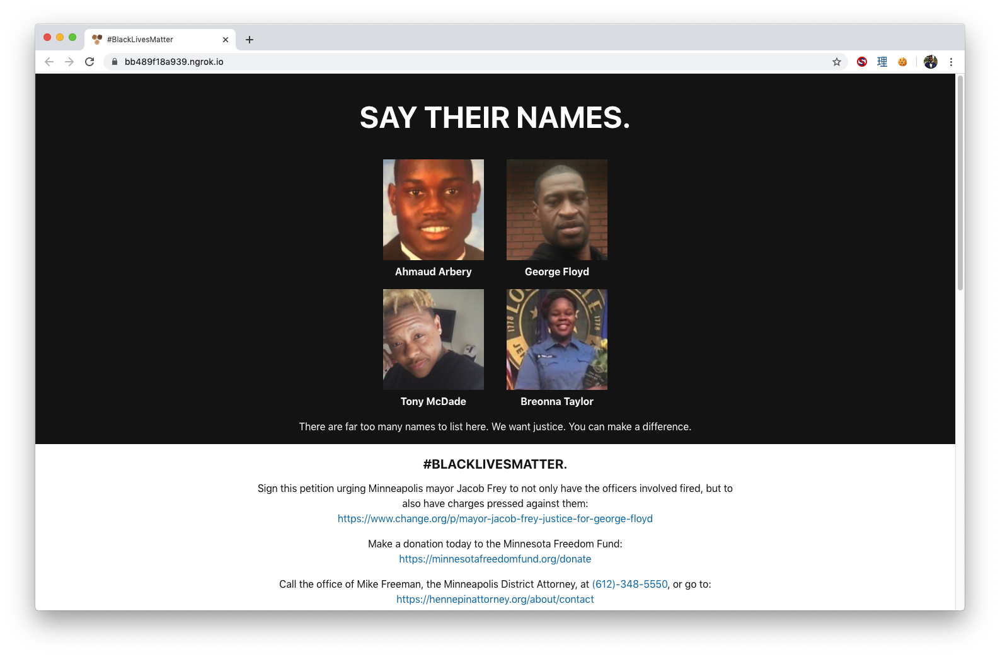

# #BLMBlackout
By sharing this repo to your GitHub followers, and changing your landing page
to the `index.html` here, you can spread awareness of the police brutality
problem in the United States, and provide your visitors with links to resources,
and ways they can help activist organizations.

[See it live on GitHub Pages](https://thosakwe.github.io/blm-blackout).



## How
The easiest way to get this as your new homepage is simply to upload the `index.html`
to your server. 

Alternatively, you can set up a redirect with `nginx`:

```
server {
  location / {
    return 302 https://thosakwe.github.io/blm-blackout;
  }
}
```

**After updating your homepage, make sure to Tweet
[#BLMBlackout](https://twitter.com/search?q=%23blmblackout&src=typeahead_click&f=live).**

**Be sure to star or fork the repo as well, as that will get it in front of more eyes.**

## Why
For far too long, Black people in the United States have suffered unjust treatment at the hands of the criminal justice system. This includes, but is not limited to, police brutality. Too often, police who kill unarmed Black people get away with paid leave, and no criminal charges. We want justice to finally be served, and we want the American police system to be greatly reformed.

Unsurprisingly, Twitter is absolutely full of people speaking up and urging others to make
an impact. However, not everyone uses Twitter. Bringing a blackout campaign to GitHub
is one way to bring awareness to another large community, especially one where activism
is minimal.

## What Next?
If this problem could be solved simply by making a webpage, then it would been solved
ages ago. In addition to changing your homepage,

The gray section on the page contains links and calls to action that you can engage
with from the comfort of your own home.

Protesting may be difficult during a pandemic, and can be scary, so if you decide to do it, make sure you're safe. Make sure you are properly prepared to avoid harm:
https://twitter.com/angelaerin777/status/1266098511172431872?s=21